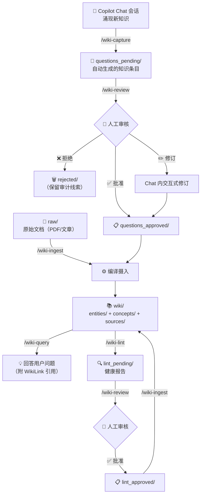

# awesome-copilot-x

> GitHub Copilot 自定义扩展集合 — Skills、Agents、Instructions、Hooks。

## 安装

```bash
# Clone 到本地
git clone <repo-url> awesome-copilot-x

# 配置环境变量（指向 llm-wiki 数据仓库）
export LLM_WIKI_PATH=/path/to/llm-wiki
```

## Plugins 目录结构

```
plugins/
├── skills/                     # Copilot Skills（自定义斜杠命令）
│   ├── wiki-ingest/SKILL.md    # 文档摄入
│   ├── wiki-query/SKILL.md     # 知识查询
│   ├── wiki-lint/SKILL.md      # 健康检查
│   ├── wiki-sync/SKILL.md      # 增量同步
│   ├── wiki-capture/SKILL.md   # 会话知识捕获
│   ├── wiki-review/SKILL.md    # 人工审核
│   └── wiki-bootstrap/SKILL.md # 冷启动引导
├── agents/                     # Copilot Agents（专用 AI agent）
│   ├── wiki-ingestor.agent.md
│   ├── wiki-querier.agent.md
│   ├── wiki-linter.agent.md
│   └── wiki-reviewer.agent.md
└── instructions/               # Copilot Instructions（共享规则）
    ├── llm-wiki-schema.instructions.md  # Wiki 页面格式规范
    └── wiki-context.instructions.md     # 跨会话上下文感知
```

## 完整流水线

LLM Wiki 采用 **Human-Gated Compounding Loop**（人机审核循环）：自动生成的内容永远先进入 `*_pending/` 等待人工审核，确认后才编译为正式 Wiki 页面。



> **核心原则**：人工审核不可跳过。自动生成的内容永远先进入 `*_pending/`，必须经人类确认才能进入 Wiki。去重时遵循「宁多勿少」—— 不确定是否重复就创建新页面，合并错误的代价远大于合并重复。

## LLM Wiki Skills 速览

| 分类 | 命令 | 功能 | 输入 → 输出 | 适用范围 |
|------|------|------|------------|----------|
| 核心 | `/wiki-capture` | 从 Chat 会话提取结构化知识 | Chat 会话 → `questions_pending/` | **任意**工作区 |
| 核心 | `/wiki-review` | 人工审核 pending 条目（支持 all/batch/slug 模式） | `questions_pending/` → `questions_approved/` 或 `rejected/` | `$LLM_WIKI_PATH` 工作区 |
| 核心 | `/wiki-ingest` | 编译摄入已批准的知识和原始文档 | `questions_approved/` + `raw/` → `wiki/` | `$LLM_WIKI_PATH` 工作区 |
| 核心 | `/wiki-query` | 查询 Wiki 知识库，返回带 [[WikiLink]] 引用的综合回答 | 用户问题 → 带引用的答案 | `$LLM_WIKI_PATH` 工作区 |
| 核心 | `/wiki-lint` | 健康检查：发现矛盾、孤立页面、过期内容、格式违规 | `wiki/` → `lint_pending/` | `$LLM_WIKI_PATH` 工作区 |
| 辅助 | `/wiki-sync` | 基于 Commit SHA checkpoint 增量同步到远程 | 本地变更 → 远程仓库 | `$LLM_WIKI_PATH` 工作区 |
| 辅助 | `/wiki-bootstrap` | 从 GitHub 仓库冷启动构建 Wiki | GitHub 仓库 → 初始 Wiki 页面 | `$LLM_WIKI_PATH` 工作区 |

## Agent 配置

每个 Agent 对应一个 Skill，在 Copilot Chat 中通过 `@agent-name` 调用：

| Agent | 对应 Skill | 可用工具 |
|-------|-----------|----------|
| `@wiki-ingestor` | `/wiki-ingest` | read_file, create_file, replace_string_in_file, list_dir, run_in_terminal, grep_search |
| `@wiki-querier` | `/wiki-query` | read_file, list_dir, grep_search |
| `@wiki-linter` | `/wiki-lint` | read_file, create_file, list_dir, run_in_terminal, grep_search |
| `@wiki-reviewer` | `/wiki-review` | read_file, create_file, replace_string_in_file, list_dir, run_in_terminal |

## Instruction 说明

| Instruction | applyTo | 作用 |
|-------------|---------|------|
| `llm-wiki-schema.instructions.md` | `**/wiki/**/*.md` | 所有 Wiki 页面必须遵循的 frontmatter 规范 |
| `wiki-context.instructions.md` | `**` | 会话启动时自动读取 Wiki 热缓存，提示最新状态 |

## 环境变量

| 变量 | 必填 | 说明 |
|------|------|------|
| `$LLM_WIKI_PATH` | ✓ | 指向 `llm-wiki` 数据仓库的绝对路径 |

## 相关仓库

- [llm-wiki](https://github.com/arawlin/llm-wiki) — Wiki 数据仓库
- [docs](https://github.com/arawlin/docs) — 方案讨论、Spike 研究、实现计划
